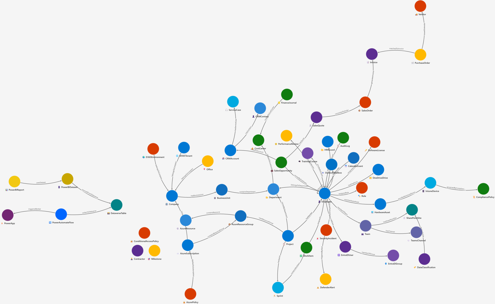

# 🏢 Enterprise Microsoft Operations Ontology

> A comprehensive OWL/RDF ontology describing the full operational model of a large enterprise built on the Microsoft technology stack.

---

## 📖 Overview

This ontology formally describes how a large enterprise organization operates using Microsoft tools — from identity and collaboration through to cloud infrastructure, business applications, security operations, and beyond.

The model covers **30+ entity classes**, **100+ properties**, and **40+ named relationships** spanning the full Microsoft ecosystem: Microsoft 365, Azure, Dynamics 365, Power Platform, Microsoft Sentinel, and more.

---

## 📁 Repository Contents

| File | Description |
|------|-------------|
| `enterprise_microsoft_ontology.rdf` | The OWL/XML ontology file — the primary artifact |
| `enterprise-microsoft-operations-ontology-graph.png` | Visual graph rendering of all entities and relationships |
| `README.md` | This file |

---

## 📊 Ontology Statistics

| Metric | Count |
|--------|-------|
| **Entity Classes** | 30+ |
| **Properties & Attributes** | 100+ |
| **Named Relationships** | 40+ |
| **Functional Domains** | 10 |
| **Microsoft Services Covered** | 15+ |
| **OWL Version** | OWL 2 |
| **RDF Format** | RDF/XML |

**Microsoft Services Included:**
- Microsoft 365 (Teams, SharePoint, Outlook, OneDrive)
- Azure (Subscriptions, Resource Groups, Policies, Cost Management)
- Dynamics 365 (Sales, Customer Service, Finance, Project Operations, Human Resources)
- Power Platform (Power Apps, Power Automate, Power BI, Dataverse)
- Microsoft Sentinel & Defender XDR
- Entra ID (formerly Azure AD)
- Microsoft Purview
- Intune
- Microsoft Viva (Learning, Goals)

---

## 🗂️ Ontology Scope

The ontology is organized into **10 functional domains**:

### 1. 🏛️ Organizational Structure
`Company` · `BusinessUnit` · `Department` · `CostCenter` · `Office`

Models the legal entity, divisional hierarchy, departmental breakdown, and financial cost center mapping as used in **Dynamics 365 Finance** and **Entra ID**.

### 2. 👤 People & Identity
`Employee` · `Contractor` · `Role` · `Team`

Each employee is linked to their **Entra ID** account, **Outlook** mailbox, **OneDrive**, software licenses, hardware assets, and HR record. Manager hierarchy is captured via the `reportsTo` relationship and team membership.

### 3. 📋 Projects & Agile Delivery
`Project` · `Sprint` · `WorkItem` · `Milestone`

Full project lifecycle tracked in **Azure DevOps** and **Dynamics 365 Project Operations**. Supports Agile methodologies (Scrum, SAFe, Kanban, Waterfall) with work item types: Epic, Feature, User Story, Bug, Task, and Test Case.

### 4. ☁️ Azure Cloud Infrastructure
`AzureSubscription` · `AzureResourceGroup` · `AzureResource` · `AzurePolicy`

Resource hierarchy from subscription → resource group → individual resource. Captures SKU, region, monthly cost (**Azure Cost Management**), provisioning state, and governance via **Azure Policy**.

### 5. 🌐 Microsoft 365 Collaboration
`M365Tenant` · `TeamsChannel` · `SharePointSite` · `OneDriveDrive` · `OutlookMailbox` · `CalendarEvent`

The full M365 collaboration surface — tenant root, Teams groups and channels, SharePoint sites, mailboxes, and calendar events.

### 6. ⚡ Power Platform
`PowerApp` · `PowerAutomateFlow` · `PowerBIReport` · `PowerBIDataset` · `DataverseTable`

End-to-end Power Platform chain including data lineage: Dataverse tables → Power BI datasets → reports, and flow triggers from Power Apps.

### 7. 💼 Dynamics 365 Business Applications
`CRMAccount` · `CRMContact` · `SalesOpportunity` · `SalesQuote` · `SalesOrder` · `ServiceCase` · `FinanceJournal` · `PurchaseOrder` · `Vendor` · `Invoice`

Full **lead-to-cash** and **procure-to-pay** chains across Dynamics 365 Sales, Customer Service, and Finance.

### 8. 💻 Asset & License Management
`HardwareAsset` · `SoftwareLicense` · `IntuneDevice` · `CompliancePolicy`

Hardware inventory, Microsoft software licensing (EA, CSP, MCA, MPSA), Intune device enrollment, and compliance policy assignment.

### 9. 🔒 Security & Governance
`SecurityIncident` · `DefenderAlert` · `DataClassification` · `AuditLog` · `ConditionalAccessPolicy`

Security operations coverage across **Microsoft Sentinel**, **Defender XDR**, **Microsoft Purview** (sensitivity labels, audit logs), and **Entra ID Conditional Access**.

### 10. 🎓 HR & Learning
`HRRecord` · `TrainingCourse` · `PerformanceReview`

Employee lifecycle in **Dynamics 365 Human Resources** and learning management via **Microsoft Viva Learning** and **Viva Goals**.

---

## 🔗 Key Relationships

| From | Relationship | To |
|------|-------------|-----|
| `Company` | hasBusinessUnit | `BusinessUnit` |
| `Employee` | reportsTo | `Employee` |
| `Employee` | hasEntraIdUser | `EntraIDUser` |
| `Employee` | assignedLicense | `SoftwareLicense` |
| `Project` | hasSprint | `Sprint` |
| `Sprint` | containsWorkItem | `WorkItem` |
| `AzureSubscription` | containsResourceGroup | `AzureResourceGroup` |
| `SalesOpportunity` | hasQuote → convertedToOrder → generatesInvoice | `Invoice` |
| `PowerBIDataset` | sourcedFromDataverse | `DataverseTable` |
| `SecurityIncident` | triggeredByAlert | `DefenderAlert` |
| `HardwareAsset` | enrolledAsIntuneDevice | `IntuneDevice` |

---

## 🔍 Use Cases

This ontology is valuable for organizations that need to:

### 1. **Enterprise Data Governance**
- Map and catalog all data assets across the Microsoft ecosystem
- Establish clear data ownership and stewardship
- Enforce compliance and retention policies
- Create audit trails across M365, Azure, and Dynamics 365

### 2. **Knowledge Graph Construction**
- Build comprehensive enterprise knowledge graphs
- Link business processes to IT infrastructure
- Track cross-domain dependencies
- Enable advanced analytics and pattern discovery

### 3. **Microsoft Ecosystem Mapping**
- Visualize how Microsoft 365, Azure, Dynamics 365, and Power Platform interconnect
- Understand the complete operational model
- Identify integration opportunities
- Plan cloud migration strategies

### 4. **Compliance & Audit Tracking**
- Demonstrate regulatory compliance (SOX, HIPAA, GDPR, ISO 27001)
- Track who has access to what resources
- Audit security incidents and their impact
- Generate compliance reports with data lineage

### 5. **Data Lineage & Impact Analysis**
- Trace data from source to consumption
- Understand business process flows
- Perform impact analysis for changes
- Support incident response investigations

### 6. **Integration Testing Frameworks**
- Validate integration points between systems
- Test data consistency across Microsoft services
- Verify compliance policy enforcement
- Simulate enterprise scenarios in test environments

### 7. **Master Data Management (MDM)**
- Establish single source of truth for entities
- Resolve duplicates across systems
- Maintain data quality standards
- Synchronize data across Dynamics 365, M365, and Azure

### 8. **AI & Machine Learning**
- Train ML models on enterprise ontology for predictive analytics
- Enable intelligent process automation
- Support recommendation engines
- Facilitate natural language querying of enterprise data

---

## 🛠️ Tools & Resources

### Microsoft Ontology Playground
**[@microsoft/Ontology-Playground](https://github.com/microsoft/Ontology-Playground)** | [https://microsoft.github.io/Ontology-Playground/](https://microsoft.github.io/Ontology-Playground/)

A free, open-source web application for learning about ontologies and Microsoft Fabric IQ. Explore pre-built ontologies, design your own in a visual editor, export as RDF/XML, and share interactive diagrams — all from a fully static site with zero backend dependencies.

---

## 🎯 Related Projects

Explore these complementary projects and resources:

### Ontology & Semantic Web
- **[Protégé Desktop](https://protege.stanford.edu/)** - Industry-standard ontology editor and framework
- **[Apache Jena](https://jena.apache.org/)** - Java framework for building semantic web applications and SPARQL query endpoints
- **[RDF4J](https://rdf4j.org/)** - Java framework for working with RDF data
- **[Virtuoso Open-Source](https://virtuoso.openlinksw.com/wiki/main/)** - RDF triple store with SPARQL endpoint

### Microsoft Enterprise Architecture
- **[Microsoft Cloud Adoption Framework](https://learn.microsoft.com/en-us/azure/cloud-adoption-framework/)** - Guidance for enterprise cloud transformation
- **[Azure Architecture Center](https://learn.microsoft.com/en-us/azure/architecture/)** - Reference architectures and design patterns
- **[Enterprise Skills Initiative](https://learn.microsoft.com/en-us/training/)** - Microsoft Learn training paths

### Knowledge Graphs & Data Integration
- **[LinkedData.org](https://www.linkeddata.org/)** - Linked Data standards and best practices
- **[Schema.org](https://schema.org/)** - Collaborative, community activity for creating schemas
- **[YAGO Knowledge Base](https://www.yago-knowledge.org/)** - Large semantic knowledge base

### Governance & Compliance
- **[Microsoft Purview](https://www.microsoft.com/en-us/security/business/microsoft-purview)** - Unified data governance platform
- **[Microsoft Sentinel](https://learn.microsoft.com/en-us/azure/sentinel/)** - Cloud-native SIEM and SOAR
- **[Azure Policy](https://learn.microsoft.com/en-us/azure/governance/policy/)** - Governance and compliance management

---

## 🧩 Namespace

| Prefix | URI |
|--------|-----|
| `ont:` | `http://example.org/ontology/enterprise-msft/` |
| `owl:` | `http://www.w3.org/2002/07/owl#` |
| `rdf:` | `http://www.w3.org/1999/02/22-rdf-syntax-ns#` |
| `rdfs:` | `http://www.w3.org/2000/01/rdf-schema#` |
| `xsd:` | `http://www.w3.org/2001/XMLSchema#` |

---

## 🔧 Extending the Ontology

To adapt this ontology to your organization:

1. Replace `http://example.org/ontology/enterprise-msft/` with your own base URI (e.g., `https://ontology.contoso.com/enterprise/`)
2. Update `company_tenantId` and `company_domainName` with your actual Microsoft tenant values
3. Add subclasses using `<rdfs:subClassOf>` to model specialized entity types
4. Add instance data (individuals) to represent real objects in your organization

---

## 📄 License

This ontology is released under the [MIT License](LICENSE). You are free to use, adapt, and redistribute it with attribution.

---

## 🙏 Acknowledgements

Built using open standards:
- [OWL 2 Web Ontology Language](https://www.w3.org/TR/owl2-overview/)
- [RDF 1.1 Concepts](https://www.w3.org/TR/rdf11-concepts/)
- [XML Schema Datatypes](https://www.w3.org/TR/xmlschema-2/)

Microsoft product and service names are trademarks of Microsoft Corporation.
